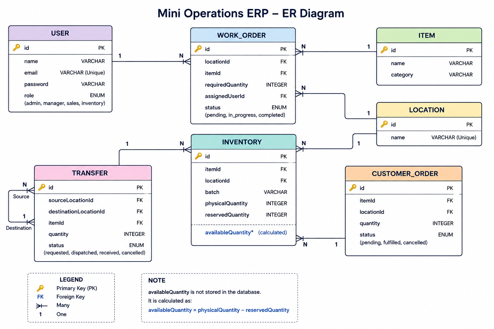

# Mini Operations ERP

## ER Diagram

The following ER diagram represents the relational database structure of the Mini Operations ERP, including users, items, locations, inventory, work orders, transfers, and customer orders.

